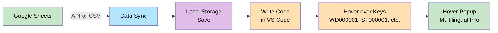
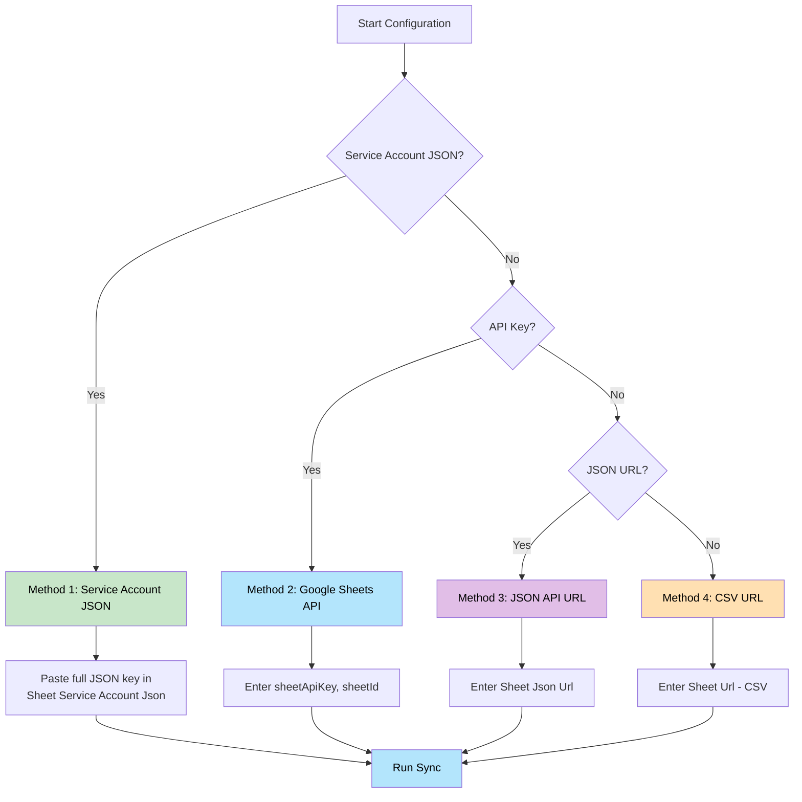
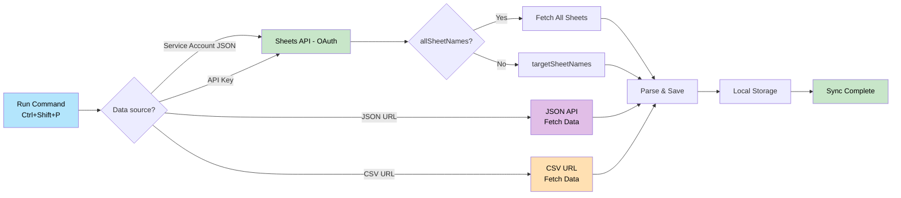
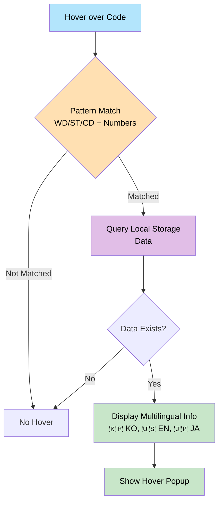
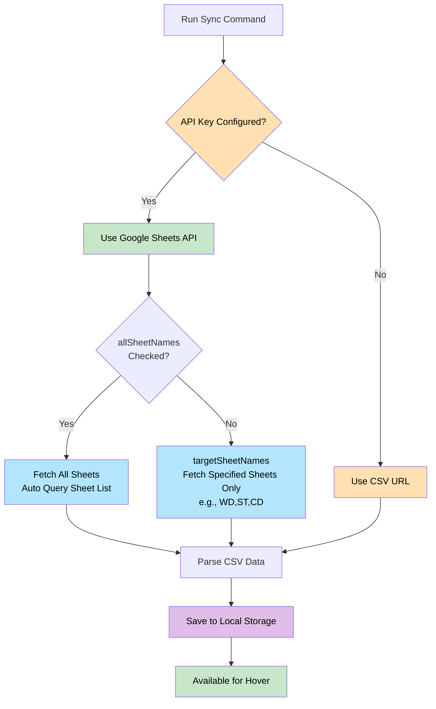
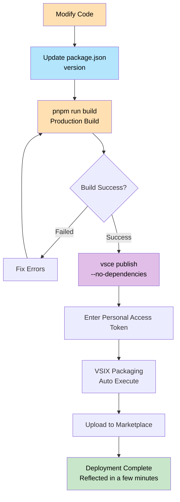

# Sheet Language Global Helper

A VS Code extension that fetches multilingual data from Google Sheets and displays it via hover in your code.

## 🌐 Languages

- [English](README.md) (Current)
- [한국어 (Korean)](README.ko.md)

## 🔗 Links

- 📦 [VS Code Marketplace](https://marketplace.visualstudio.com/items?itemName=language-global-helper.lang-global-helper)
- 💻 [GitHub Repository](https://github.com/jinyDuo/colo-language-extension)

## ✨ Features

- 📊 **Google Sheets Integration**: Fetch data via **Service Account JSON**, Google Sheets API key, **JSON API URL**, or CSV URL
- 🔍 **Hover Feature**: Hover over keys starting with `WD`, `ST`, `CD` in your code to see multilingual information
- 🏷️ **Inline Translation (Inlay Hints)**: Show translations inline next to keys and translation calls (no hover needed)
- 💾 **Local Caching**: Data is stored in local storage for offline use
- 🔄 **Manual Sync**: Update to the latest data only when needed
- 📝 **Multi-Sheet Support**: Fetch multiple sheets (WD, ST, CD, etc.) at once
- 📤 **Export to workspace JSON**: Under **`workspaceExportJsonPath`** (**required**): **`all_language.json`** and **`{prefix}_lang.json`** files contain **only** keys that match **Target Sheet Names** (`targetSheetNames`). Keys that match no prefix are **not** written to disk.

### Complete Workflow



## 🚀 Getting Started

### Installation

1. Open VS Code Extensions Marketplace with `Ctrl + Shift + X` (or `Cmd + Shift + X` on Mac)
2. Search for "Sheet Language Global Helper"
3. Click Install

### Configuration

Open VS Code settings with `Ctrl + ,` (or `Cmd + ,` on Mac) and search for "Sheet Language Global Helper".

**If hint-related settings (Show Inline Translation, Inline Translation Language, Hover Key Patterns) do not appear:**

1. **Scroll down** in the extension settings — they may be below the sheet/API options.
2. **Search** for `inline` or `hoverKey` in the settings search box to jump to them.
3. **Add manually** — `Cmd + Shift + P` → "Open User Settings (JSON)", then add:

```json
"languageHelper.showInlineTranslation": true,
"languageHelper.inlineTranslationLanguage": "ko",
"languageHelper.hoverKeyPatterns": "WD,ST,CD"
```

Also ensure **Editor: Inlay Hints** is set to `on` in VS Code settings so inline hints are visible.

**Data source priority:** Service Account JSON → API Key → JSON API URL → CSV URL (first available is used).

#### Method 1: Service Account JSON (Priority 1, recommended for private sheets)

1. **Create a Service Account**
   - Go to [Google Cloud Console](https://console.cloud.google.com/) → IAM & Admin → Service Accounts → Create Service Account
   - Create a key (JSON) and download the file

2. **Share the spreadsheet** with the service account email (e.g. `xxx@project.iam.gserviceaccount.com`) as Viewer

3. **VS Code Settings**
   - **Sheet Service Account Json**: Paste the **entire contents** of the JSON key file (not the file path)
   - **Sheet Id** or **Sheet Url**: Spreadsheet ID or full URL
   - **All Sheet Names** / **Target Sheet Names**: Choose which sheets to fetch

#### Method 2: Google Sheets API Key (Priority 2)

1. **Get API Key**
   - Go to [Google Cloud Console](https://console.cloud.google.com/) → APIs & Services > Library → Enable "Google Sheets API"
   - APIs & Services > Credentials > Create API Key

2. **Share Sheet Settings** ⚠️ Required
   - Open your Google Spreadsheet → **Share** → **Anyone with the link** → **Viewer**

3. **VS Code Settings**
   - **Sheet Api Key**: Enter your API key
   - **Sheet Id**: Spreadsheet ID or full URL
   - **All Sheet Names** / **Target Sheet Names**: As needed

#### Method 3: JSON API URL (Priority 2 alternative)

- Use a URL that returns JSON (e.g. your own API or published JSON).
- **Sheet Json Url**: Enter the URL. Response must be an array `[{ "key", "ko", "en", ... }]` or an object `{ "WD001": { "ko": "...", "en": "..." }, ... }`.

#### Method 4: CSV URL (Priority 3)

1. In Google Spreadsheet, go to **File > Share > Publish to web** → Select CSV format
2. **Sheet Url**: Enter the generated CSV URL

> 💡 **Priority**: Service Account JSON → API Key or JSON URL → CSV URL. The first one you configure is used.

### Configuration Method Comparison



## 📖 Usage

### Command Palette

Open the Command Palette (`Ctrl + Shift + P` / `Cmd + Shift + P`) and run:

| Command | What it does |
|---------|----------------|
| **Sheet Language Global Helper: Sheet Connect Sync** | Fetches data from your configured source (Service Account JSON, API Key, JSON URL, or CSV URL) and saves it to extension local storage for hover and inlay hints. The Output channel ("Sheet Language Global Helper") logs the total count and per-tab row count for each fetched sheet. |
| **Sheet Language Global Helper: Sheet Sync to JSON** | **Automatically fetches the latest sheet data first** (same path as Sheet Connect Sync), then writes under **`workspaceExportJsonPath`**: **`all_language.json`** (union of keys matching **`targetSheetNames`** prefixes) and one **`{prefix}_lang.json`** per prefix that has at least one key. Unmatched keys are omitted. Longer prefixes win when overlapping. **Empty `workspaceExportJsonPath` → error.** Each processing stage (keys received → after prefix match → after language filter) is logged to the Output channel. |

### Data Synchronization

1. Press `Ctrl + Shift + P` → Run **Sheet Language Global Helper: Sheet Connect Sync**
2. On success you should see an information toast and/or the **Output** panel (channel **Sheet Language Global Helper**) with a line like: `동기화 완료! (N개 데이터, … 사용)`.
3. On failure, an error message appears; details are also logged to the same Output channel.

> **Cursor / some editors:** If the success toast does not appear, open **View → Output**, choose **Sheet Language Global Helper** in the dropdown, and check the latest log line.

#### Synchronization Process



### Export to a JSON file (Sheet Sync to JSON)

Use this when you want a **file on disk** (e.g. for code review, build scripts, or documentation) always reflecting the **current sheet state**.

1. Open a **folder** in VS Code (not only single files without a workspace folder).
2. Set **`workspaceExportJsonPath`** (e.g. `language` or `src/locales`). **Required** — if empty, the export command **shows an error**. No `..` segments; use a path relative to the first workspace folder root.
3. Optionally adjust **`targetSheetNames`** (comma-separated sheet/prefix list, same as sync). Export uses this list to split keys: e.g. `WD,ST,MS` → `wd_lang.json`, `st_lang.json`, `ms_lang.json` (only files with at least one key are created).
4. Run **Sheet Language Global Helper: Sheet Sync to JSON**. The command **fetches the latest data from the sheet first** (no separate Sync needed), then the folder (and any missing parent segments) is created if needed:
   - **`all_language.json`** — only keys whose code starts with one of the **`targetSheetNames`** prefixes (same union as the per-prefix files)
   - **`{lowercasePrefix}_lang.json`** — one per **`targetSheetNames`** entry that has at least one matching key (empty prefixes are skipped)

**JSON shape** (each file is an object: code key → language code → text):

```json
{
  "WD000001": {
    "ko": "안녕하세요",
    "en": "Hello",
    "ja": "こんにちは"
  }
}
```

**Multi-root workspaces:** The export path is resolved under the **first** folder listed in the workspace. To use another folder, reorder folders or open that folder alone.

### View Multilingual Info via Hover

Hover over keys matching the patterns specified in `hoverKeyPatterns` to see multilingual information:

```typescript
const code = "WD000001";  // Shows multilingual info on hover
getLang("ST000001");      // Also detects inside function calls
t("CD000001");            // Supports getLang, t, i18n, translate, etc.
```

**Display Info**: 🇰🇷 KO, 🇺🇸 EN, 🇯🇵 JA

#### Hover Example


*Example: Hovering over `WD000527` displays multilingual translations (EN: Client, KO: 클라이언트)*

#### How Hover Works



### Show Inline Translation (Inlay Hints)

After running sync, translations can be displayed inline (without hover) as inlay hints:

```typescript
t("WD000001");         // → Hello (based on inlineTranslationLanguage)
t("프로그램 등록");      // → Program Registration (if your sheet key is the Korean text)
```

#### Inlay Hints Example


> Note: Inlay hints are refreshed automatically after sync and when related settings change.

## ⚙️ Configuration

Settings use the prefix `languageHelper.` (e.g. `languageHelper.sheetApiKey` in `settings.json`).

| Setting key | Description | Required | Default |
|-------------|-------------|----------|---------|
| `sheetServiceAccountJson` | Full text of the Google **service account JSON key** (Priority 1). | If using service account | (empty) |
| `sheetApiKey` | Google Sheets **API key** (Priority 2). | If using API without service account | (empty) |
| `sheetJsonUrl` | URL returning JSON dictionary (array or object shape) (Priority 2 alt.). | If using JSON URL | (empty) |
| `sheetId` | Spreadsheet ID (optional if `sheetUrl` contains the URL). | For Sheets API | (empty) |
| `sheetUrl` | Published **CSV** URL (Priority 3). | If using CSV only | (empty) |
| `allSheetNames` | Fetch all sheets in the spreadsheet. | Optional | `true` |
| `targetSheetNames` | Comma-separated sheet names when `allSheetNames` is off. | Optional | `WD,ST,CD` |
| `hoverKeyPatterns` | Comma-separated patterns for hover/inlay (e.g. `WD,ST,CD`). | Optional | `WD,ST,CD` |
| `showInlineTranslation` | Show inlay hints for translations. | Optional | `true` |
| `inlineTranslationLanguage` | Language code for inlay text (`ko`, `en`, …). | Optional | `ko` |
| `workspaceExportJsonPath` | **Required for export:** relative folder under the first workspace root (e.g. `language`). Empty → export command errors. No `..`. | **Export** | (empty) |

### How It Works



**Summary**:
- **API Key Available**: Use Google Sheets API
  - `allSheetNames` checked → Fetch all sheets
  - `allSheetNames` unchecked → Fetch only sheets specified in `targetSheetNames`
- **No API Key**: Use CSV URL (single sheet only)

## 📝 Spreadsheet Format

| key | ko | en | ja |
|-----|----|----|----|
| WD000001 | 안녕하세요 | Hello | こんにちは |
| ST000001 | 감사합니다 | Thank you | ありがとう |

- First row is used as header
- `key` column is required; `ko`, `en`, `ja` are optional

## 🐛 Troubleshooting

### "API Key is Invalid"
- Verify Google Sheets API is enabled
- Check if the sheet is shared with "Anyone with the link"

### "Sheet ID is Incorrect"
- Verify the ID is correctly extracted from the spreadsheet URL

### "Invalid URL" / URL errors
- Use a full URL with `https://` for **Sheet Json Url** and **Sheet Url**, or a host-only value (the extension may prepend `https://`).
- Do not paste a spreadsheet **ID** into the CSV/JSON URL fields; use **Sheet Id** / **Sheet Url** (full link) for the API path.

### Export JSON: "no workspace folder"
- Open **File → Open Folder** so a folder is the workspace root, then run the export command again.

### Export JSON: path setting empty / error
- Set **`workspaceExportJsonPath`** (e.g. `language`). The export command **requires** this; it errors if blank.

### Export JSON: "no data" / warning about no matching keys
- Check that **`targetSheetNames`** matches the key prefixes in your sheet (e.g. `WD,ST,CD`). The export fetches fresh data automatically, so a separate Sync is not required.

### Hover Not Working
- Make sure data synchronization has been run first
- Verify you're using keys starting with `WD`, `ST`, `CD` in your code

## 🛠️ Development

### Requirements

- **Node.js 20.x or higher** (Required)
- pnpm (or npm)

### Installation and Build

```bash
# Install dependencies
pnpm install

# Development mode (watch)
pnpm run watch

# Production build
pnpm run build
```

### Testing

1. Press `F5` to run Extension Development Host
2. Create a test file in the new window
3. Hover over codes like `WD000001` to verify

## 📦 Deployment

### Prerequisites

1. Create account/organization on [Azure DevOps](https://dev.azure.com/)
2. Generate Personal Access Token (Marketplace > Manage permission required)

### Deployment Process



### Deployment Commands

```bash
# 1. Install vsce
pnpm add -g @vscode/vsce

# 2. Build
pnpm run build

# 3. Package VSIX
pnpm run package:vsix

# 4. Deploy (skip dependency check)
vsce publish --no-dependencies -p <YOUR_PERSONAL_ACCESS_TOKEN>
```

### Update Deployment

⚠️ **Important**: You must increment the `version` in `package.json` before redeploying after code changes.

```bash
# 1. Update version in package.json (e.g., 0.0.1 → 0.0.2)
# 2. Build and deploy
pnpm run build
vsce publish --no-dependencies -p <TOKEN>
```

### Apply Icon

1. Add `icon.png` to root folder (128x128 recommended)
2. Add `"icon": "icon.png"` to `package.json`
3. Update version and redeploy

## 📄 License

MIT

## 🤝 Contributing

Issues and pull requests are welcome!

---

**Made with ❤️ for better multilingual development experience**
